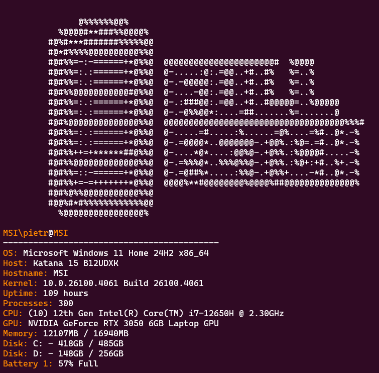
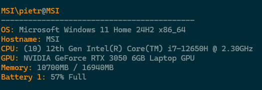

<p align= "center" style="font-size: 2em; font-weight: bold;">
    fullfetch
</p>

<p align="center">

</p>


<p style="font-size: 1.5em; font-weight: bold;" align="center">
A completely customizable CLI system information tool made with Go
</p><br><br>

<p style="font-size: 1.1em;" align="center">
fullfetch is a <a href="https://github.com/dylanaraps/neofetch">neofetch</a> and <a href="https://github.com/fastfetch-cli/fastfetch">fastfetch</a> inspired CLI application for showing system
informations and fully customizable. The customization can be modified by editing
the <code>config.json</code>.</p><br>

<p align="center">
<br>
</p>

<p style="font-size: 1.1em;" align="center">
fullfetch displays the selected properties in the config file. You can fully select the amount of properties, the order and the color for the titles. Before the output fullfetch displays a custom ASCII art, fully replaceable and customizable. In the config file you can also find pre-customized schemes.</p>

<p align="center">

</p>

<p align="center">fullfetch supports every system (in theory), and in case something is not supported open a GitHub issue.</p><br><br>

# Installation

## Windows
### Pre-Built installer
Go to the [release page](https://github.com/Buct0r/fullfetch/releases) and download the <code>fullfetch_installer_(your_arch).exe</code>.

### Portable version
Download the <code>fullfetch_portable_windows_(your_arch).zip</code> and extract it wherever you want. To make fullfetch available in every terminal, add the extracted folder address to your PATH variable.

### Winget

Open your terminal and type:
```bash
winget install fullfetch
```


## Linux
### Pre-built package
Head to the [release page](https://github.com/Buct0r/fullfetch/releases) and download the correct package for your distro and architecture. For now It's only available for debian based distros for both x86 and ARM, and rpm package only in the x86 version.

#### Debian based:
Download the <code>fullfetch_(your_arch).deb</code>. Head to the download folder with a terminal and type:
```bash
$ sudo dpkg -i fullfetch_(your_arch).deb
```
Reload the terminal and type
```bash
$ fullfetch
```

#### rpm based (fedora, Red Hat)
Download the <code>fullfetch-(current version)-1.fc42.x86_64.rpm</code>(For now only available for x86). Head to the download folder with a terminal and type:
```bash
$ sudo dnf install ~/(Downloaddir)/fullfetch-(current version)-1.fc42.x86_64.rpm
```
Reload the terminal and type
```bash
$ fullfetch
```

### Homebrew 
Add the tap:
```zsh
brew tap Buct0r/fullfetch
```
and then install it: 
```zsh
brew install fullfetch
```

## Mac OS

### Homebrew (Recommended)
Add the tap:
```zsh
brew tap Buct0r/fullfetch
```
and then install it: 
```zsh
brew install fullfetch
```

### Portable
Head to the [release page](https://github.com/Buct0r/fullfetch/releases) and download the <code>fullfetch_Darwin_(your_arch).tar.gz</code> file, and install it.


## Using Go
Requirements:
- Go(latest version)

Just type:
``` bash
$ go install github.com/Buct0r/fullfetch@latest
```

# Building

Requirements:
- Go (possibly the latest version)
- cloned repo
<br>

1) Clone the Github repo
```
git clone https://github.com/Buct0r/fullfetch.git
```
2) Head to the cloned directory and in the terminal type: 
```
go build .
```

# Customization
You can customize pretty much every aspect of fullfetch. You can choose what to display, in which order and what color should the parameters be displayed. With the
<code>go install</code> command, fullfetch uses an embedded version of the <code>config.json</code> file. If you  want to customize everything run the command:
``` bash
$ fullfetch --gen
```  

By default, running the command <code>fullfetch --gen</code> will generate a <code>config.json</code> file in the config directory for the system. There you can customize. In case the file is set to read-only, just edit the file with sudo privilegies.

Here there are all of the parameters you can customize: 

Parameters:
- art    
- title (user@hostname)   
- os       
- hostname
- kernel   
- uptime 
- processes    
- cpu    
- gpu  
- memory   
- disk   
- ip      
- colors  
- credits  
- locale   
- battery 
- host

You can also change the order of the displayed parameters by modifing the <code>"order"</code> section in the <code>config.json</code> file

There are also a vast range of colors available:
- Red
- Green
- Yellow
- Blue
- Magenta
- Cyan
- Gray
- White
- Orange
- Purple
- Pink
- Brown
- Black
- LightGray
- DarkGray
<br>
And all of the light versions of the colors.

You can choose between different pre-made color schemes and also make your own

The last thing that you can customize is the ASCII art displayed before all of the parameters. The default <code>config.json</code> file includes 3 different versions of the logo in ASCII art, but you can also make your own customized ASCII art to make fullfetch more beautiful


# Future updates
## Log 1 

Not fully completed ❌<br>
Next features:
- New customization options ✅
- More parameters to display ✅
- ARM build for rpm ❌
- Adding fullfetch to official packages repositories (apt, dnf, AUR ecc.) ❌
- Adding fullfetch to winget repository ❌
- tar.gz file for every os and arch ❌
- adding fullfetch to homebrew ❌

## Log 2
Pending ⚠️
- Adding fullfetch to official packages repositories (apt, dnf, AUR ecc.) ⚠️
- Adding fullfetch to winget repository ✅
- tar.gz file for every os and arch ✅
- adding fullfetch to homebrew ✅
- adding at least one new feature ✅

# Conclusion
Thank you for your support if you decide to install fullfetch. For every idea or improvement feel free to open a pull request<br>
Thanks to skesko for help during the testing phase. 

Developed by Buct0r ❤️